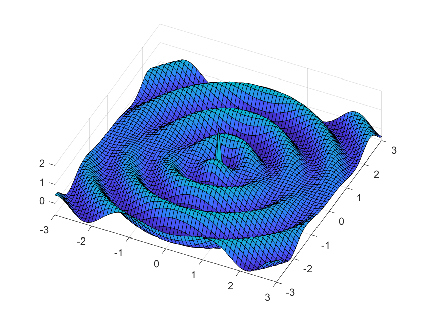
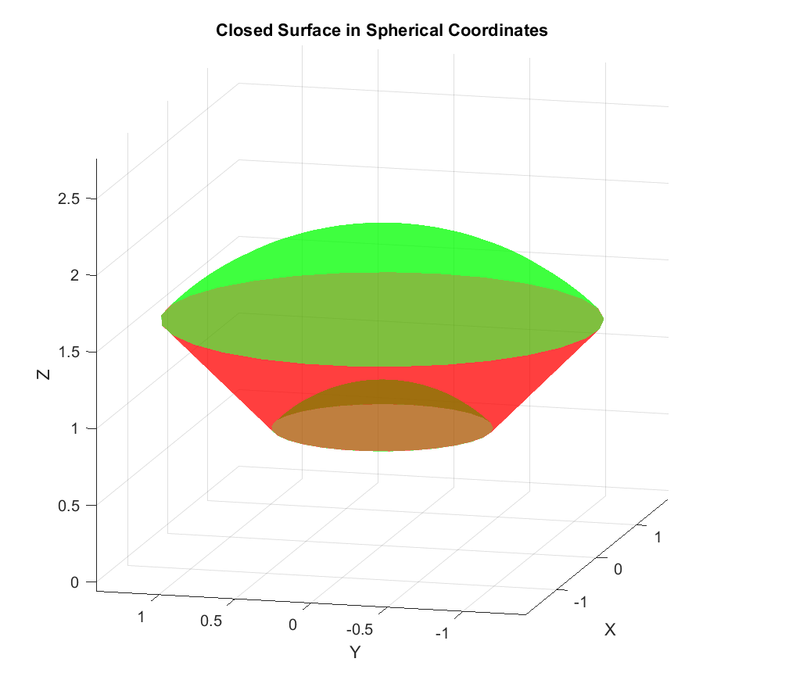
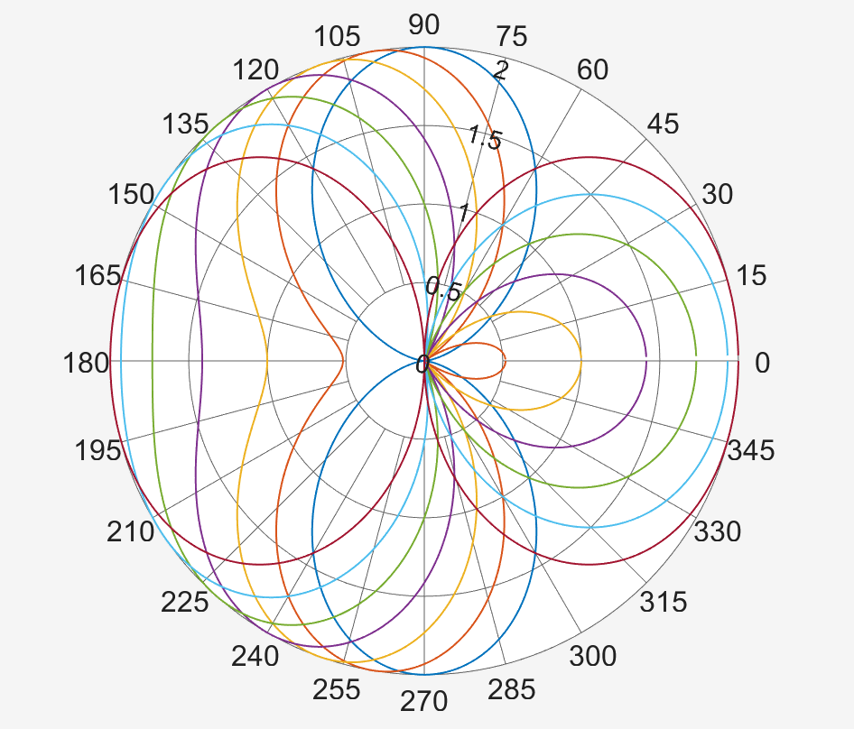
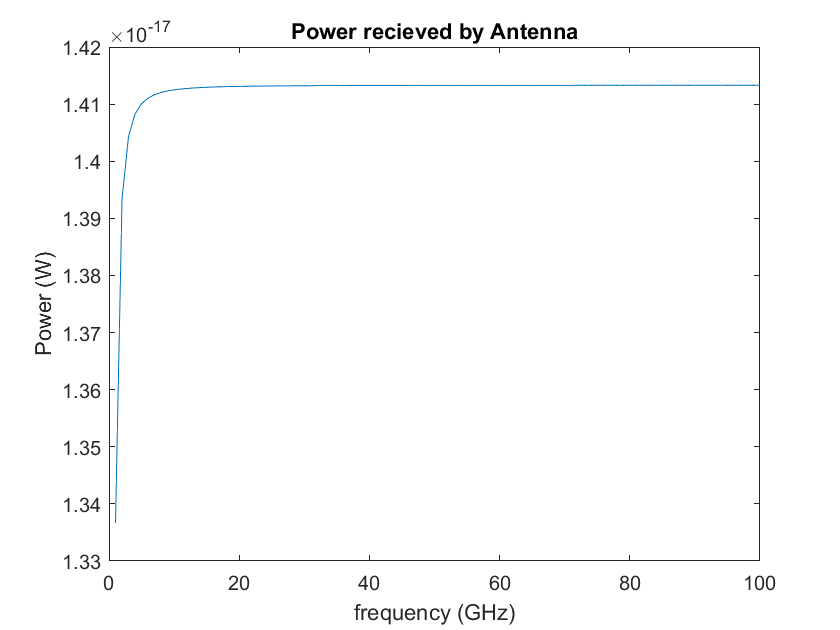
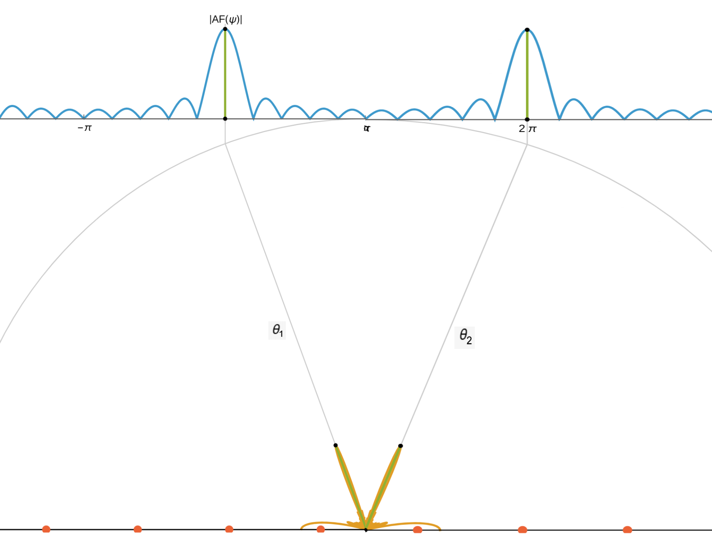

# Antenna Theory and Electromagnetic Radiation

---

## Overview
This body of work represents advanced coursework in antenna theory and applied electromagnetics, with emphasis on radiation mechanisms, near- and far-field behavior, array synthesis, beam steering, and system-level performance considerations. Assignments combined analytical derivations with numerical modeling to explore how electromagnetic fields are generated by sources, how antennas radiate and store energy, and how array configurations influence directivity and signal quality.

MATLAB and analytical EM theory were used extensively to visualize fields, radiation patterns, array factors, and performance metrics such as received power and signal-to-noise ratio.

---

## Radiated Fields from Current Elements
A central theme of the coursework was understanding how radiation arises from time-varying currents. Using analytical expressions for the electric field produced by small current elements, I derived and visualized the spatial structure of the radiated field in three dimensions.

These simulations highlight the distinction between radiating and non-radiating configurations, showing how current orientation and geometry directly affect field strength and spatial distribution.

  

**Figure:** Electric field magnitude produced by current elements, illustrating how current orientation influences radiation versus guided-wave behavior.  
(From HW 1 — analytical field derivation and numerical visualization :contentReference[oaicite:0]{index=0})

---

## Near-Field Energy Storage and Reactive Power
Beyond radiation, antennas store energy in their near fields. To investigate this behavior, I analyzed the complex Poynting vector and evaluated power flow through closed integration surfaces surrounding radiating structures.

This analysis demonstrates that, in the near field, power flow can be purely reactive, corresponding to energy storage rather than radiation. This distinction is critical for understanding antenna efficiency, bandwidth limitations, and electrically small antennas.

  

**Figure:** Closed integration surface used to evaluate complex power flow, illustrating reactive energy storage in the near field of a radiating structure.  
(From HW 2 — reactive power and near-field analysis :contentReference[oaicite:1]{index=1})

---

## Antenna Arrays and Beam Steering
The coursework also focused on antenna arrays and their ability to shape and steer radiation patterns through controlled phase and spacing. Using analytical array factor expressions, I modeled how relative phase shifts alter beam direction and sidelobe structure.

These results demonstrate the fundamental principles behind beam steering and array directivity, which are central to modern radar, wireless communication, and sensing systems.

  

**Figure:** Normalized array factor for a two-element antenna array, demonstrating beam steering as a function of relative phase shift.  
(From HW 4 — array factor synthesis and visualization :contentReference[oaicite:2]{index=2})

---

## System-Level Performance: Power and Noise
Antennas were also analyzed as system components rather than isolated radiators. Using frequency-domain models, I examined received power and signal-to-noise ratio (SNR) as functions of frequency, antenna parameters, and thermal noise.

This work connects electromagnetic theory to practical RF system design, emphasizing how antenna behavior directly impacts communication performance.

  

**Figure:** Received power and signal-to-noise ratio versus frequency, illustrating the impact of antenna characteristics and noise on system performance.  
(From HW 4 — power and SNR analysis :contentReference[oaicite:3]{index=3})

---

## Beam Separation and Array Optimization
In later assignments, numerical methods were used to explore beam separation and array behavior under varying phase and spacing parameters. Random sampling and visualization techniques were applied to identify configurations that minimize beam separation and reveal array symmetry.

This analysis reinforces the sensitivity of array performance to design parameters and highlights tradeoffs encountered in practical array synthesis.

  

**Figure:** Beam separation analysis for array configurations, illustrating how phase and spacing influence angular resolution.  
(From HW 6 — numerical optimization and visualization :contentReference[oaicite:4]{index=4})

---

## What This Work Demonstrates
- Strong foundation in electromagnetic field theory and antenna radiation
- Ability to derive and interpret analytical field expressions
- Numerical modeling and visualization of EM phenomena using MATLAB
- Understanding of near-field vs far-field behavior and reactive power
- Antenna array synthesis, beam steering, and performance tradeoffs
- System-level thinking linking antennas to noise and communication performance
