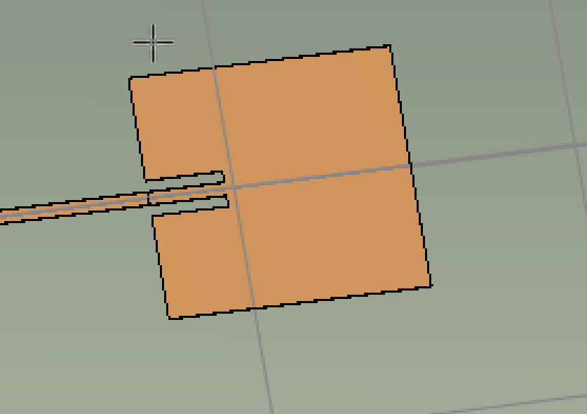
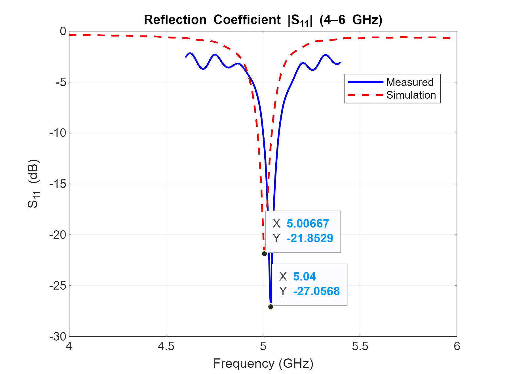
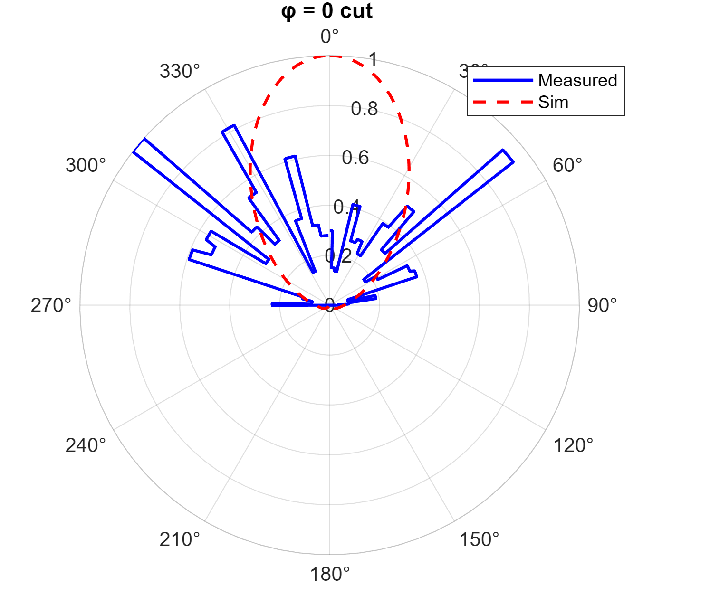
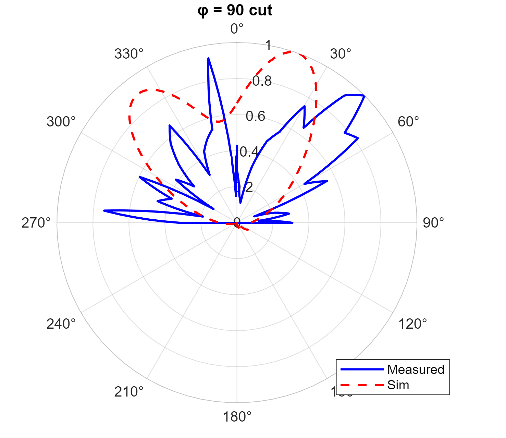
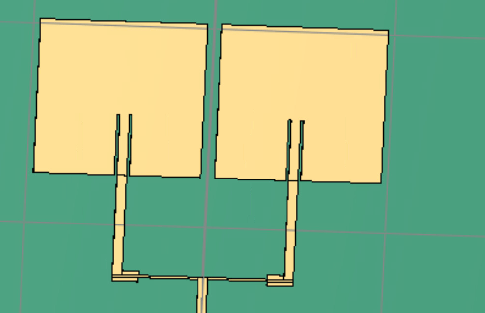
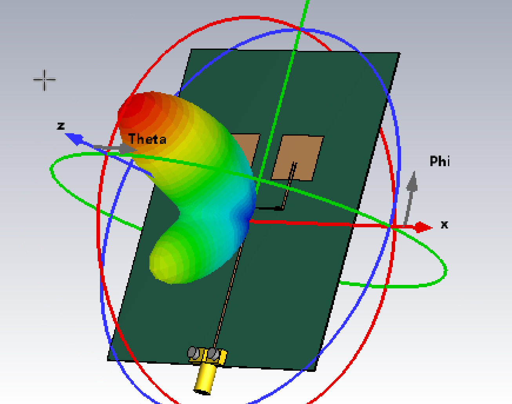

# Microstrip Patch Antenna Design and Analysis at 5 GHz

---

## Overview
This project involved the design, simulation, and analysis of a microstrip patch antenna operating at 5 GHz using full-wave electromagnetic simulation tools. The goal was to explore the practical challenges of high-frequency antenna design, including impedance matching, radiation pattern control, sidelobe behavior, and sensitivity to substrate and feed parameters.

While the antenna met its target operating frequency, the design process revealed several non-ideal behaviors—most notably elevated sidelobe levels and distorted radiation patterns—providing valuable insight into real-world antenna tradeoffs and design iteration.

---

## Antenna Geometry and Simulation Setup
The antenna was designed as a single microstrip patch with an inset feed, modeled and simulated in CST. Initial expectations were that a 5 GHz design would be relatively straightforward; however, operation at this frequency band proved to be highly sensitive to geometry, substrate thickness, and feed impedance.

  

**Figure:** CST model of the microstrip patch antenna and feed structure.  
(From project design screenshots :contentReference[oaicite:1]{index=1})

---

## Reflection Coefficient (S₁₁) Performance
The antenna was designed to resonate at 5 GHz, and the simulated S₁₁ response confirms acceptable impedance matching near the target frequency.

  

**Figure:** Simulated S₁₁ versus frequency showing resonance near 5 GHz.  
(From project report S₁₁ analysis :contentReference[oaicite:2]{index=2})

Although matching performance was reasonable, changes to inset depth and patch dimensions had limited impact on improving radiation behavior, indicating that impedance matching alone was not the dominant issue.

---

## Radiation Pattern Analysis
Far-field radiation patterns were examined for multiple φ cuts to assess antenna directivity and sidelobe behavior. To enable comparison between simulated and measured results, radiation data was linearized rather than expressed in dB.

  

  

**Figure:** Far-field directivity patterns for φ = 0° and φ = 90° cuts, comparing simulation and measured results.  
(From radiation pattern comparison section :contentReference[oaicite:3]{index=3})

The presence of a large sidelobe significantly degraded pattern quality and made interpretation of measured data difficult. This behavior was consistent across multiple geometry variations, suggesting a deeper structural or feeding issue.

---

## Diagnosis and Design Iteration
Further investigation revealed that the substrate thickness had been unintentionally altered during the design process. Although this change did not significantly shift the resonant frequency, it affected feed impedance and radiation behavior, contributing to the observed sidelobe distortion.

Additionally, the feed line impedance was approximately 55 Ω rather than the intended 50 Ω. While subtle, this mismatch further compounded radiation pattern irregularities at 5 GHz.

To mitigate sidelobe behavior, several corrective strategies were explored based on literature review:
- Feedline tapering to improve impedance transition
- Patch geometry modification (elliptical or tapered designs)
- Transition from a single-element patch to an array configuration

---

## Array-Based Extension
As an exploratory extension, the single-patch design was expanded into a two-element array. This modification immediately demonstrated improved control over radiation behavior, confirming that array synthesis is a practical necessity for stable 5 GHz microstrip designs.

  

  

**Figure:** Two-element microstrip patch array geometry and resulting 3D radiation pattern.  
(From project extension and array visualization :contentReference[oaicite:4]{index=4})

The array configuration produced a more structured, directional radiation pattern, validating both the array theory discussed in coursework and the conclusions drawn from literature review. Most practical 5 GHz patch antennas are implemented using 4–6 element arrays for this reason.

---

## Lessons Learned
This project reinforced several key antenna design principles:

- High-frequency microstrip antennas are extremely sensitive to substrate and feed parameters  
- Acceptable impedance matching does not guarantee acceptable radiation behavior  
- Sidelobe suppression often requires geometry modification or array synthesis  
- Single-element patch antennas at 5 GHz are rarely sufficient for practical applications  
- Iterative simulation and literature-informed redesign are essential in RF engineering  

The experience provided a realistic view of antenna design beyond idealized textbook examples.

---

## What This Project Demonstrates
- Practical microstrip antenna design at microwave frequencies  
- Use of full-wave EM simulation tools (CST)  
- Interpretation of S₁₁ and far-field radiation data  
- Diagnosis of sidelobe and pattern distortion issues  
- Application of array theory to improve antenna performance  
- Engineering judgment under non-ideal and error-prone conditions
# Antenna Design Using CST Studio

