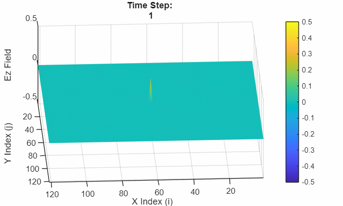
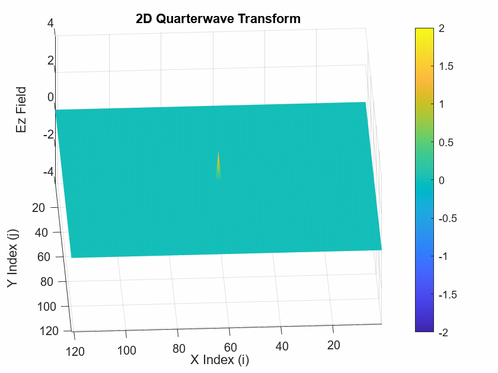
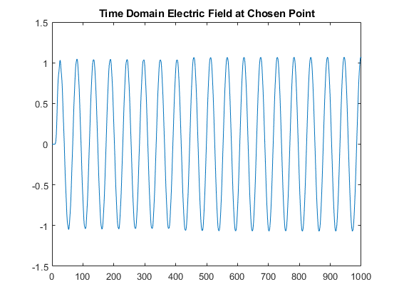

# Numerical Electromagnetic Simulation Methods in MATLAB

## Overview
This body of work demonstrates the implementation of core numerical methods used in computational electromagnetics, developed directly in MATLAB from first principles. Rather than relying on commercial solvers, each method was implemented to understand how Maxwell’s equations are discretized, how boundary conditions are enforced, and how numerical choices impact stability, accuracy, and physical interpretation.

The methods covered include finite-difference frequency-domain (FDFD), finite-difference time-domain (FDTD), the finite element method (FEM), and the method of moments (MoM). Together, these approaches represent the primary numerical tools used in RF, microwave, antenna, and scattering analysis.

---

## Finite-Difference Frequency-Domain (FDFD)
FDFD was used to solve electrostatic and quasi-static field problems by discretizing Laplace’s equation on a Cartesian grid and assembling the resulting sparse linear system. Boundary conditions were enforced explicitly, and symmetry was exploited where applicable to reduce computational cost.

To improve solver efficiency, successive over-relaxation (SOR) was implemented and analyzed. The method was extended to handle dielectric interfaces and applied to RF-relevant structures such as microstrip transmission lines, where electrostatic solutions connect directly to characteristic impedance.

---

## Finite-Difference Time-Domain (FDTD)
Time-domain electromagnetic simulation was implemented using the Yee-cell formulation with leapfrog time stepping. Electric and magnetic field components were staggered in space and time, and numerical stability was enforced through appropriate Courant-condition selection.

Absorbing boundary conditions were implemented and validated to suppress nonphysical reflections. The solver was then applied to impedance transitions, including a quarter-wave transformer implemented through spatial variation in material parameters.

  

**Figure:** Two-dimensional FDTD simulation showing time-domain wave propagation from a localized source.

  

**Figure:** FDTD simulation demonstrating effective absorbing boundary conditions with minimal edge reflection.

  

**Figure:** Time-domain field behavior through a quarter-wave impedance transformer.

---

## Time-to-Frequency Extraction from FDTD
Beyond visualization, steady-state time-domain data was post-processed to extract frequency-domain quantities. Multiple techniques were implemented, including FFT-based magnitude and phase extraction, direct DFT verification, and peak-based amplitude estimation.

Field-based computation of the reflection coefficient was compared against the expected impedance-based value, showing close agreement and validating the numerical approach.

  

**Figure:** Steady-state electric field at a measurement point used for time-to-frequency extraction.

---

## Finite Element Method (FEM)
The finite element method was developed using a one-dimensional electrostatic formulation to emphasize its mathematical structure. Linear shape functions were derived explicitly, and the elemental coefficient matrix was obtained using an energy-minimization approach.

Element matrices were assembled into a global sparse system, boundary conditions were applied, and the resulting piecewise-linear solution was interpreted as an approximation to the continuous field.

---

## Method of Moments (MoM)
The Method of Moments was implemented by reformulating electrostatic problems as integral equations over conducting boundaries. The unknown charge density was expanded using triangular basis functions, and a Galerkin weighting scheme was applied to produce a dense linear system.

Numerical quadrature was used to evaluate matrix elements, and the solved charge distribution was used to compute electric potential and electric field quantities, including far-field behavior.

---

## Summary
Across all methods, the emphasis was on understanding numerical electromagnetics at the formulation level: discretization of governing equations, matrix assembly, solver behavior, boundary-condition enforcement, and extraction of physically meaningful quantities. Collectively, this work demonstrates a strong foundation in computational EM methods relevant to RF, microwave, antenna, and applied electromagnetics engineering.

