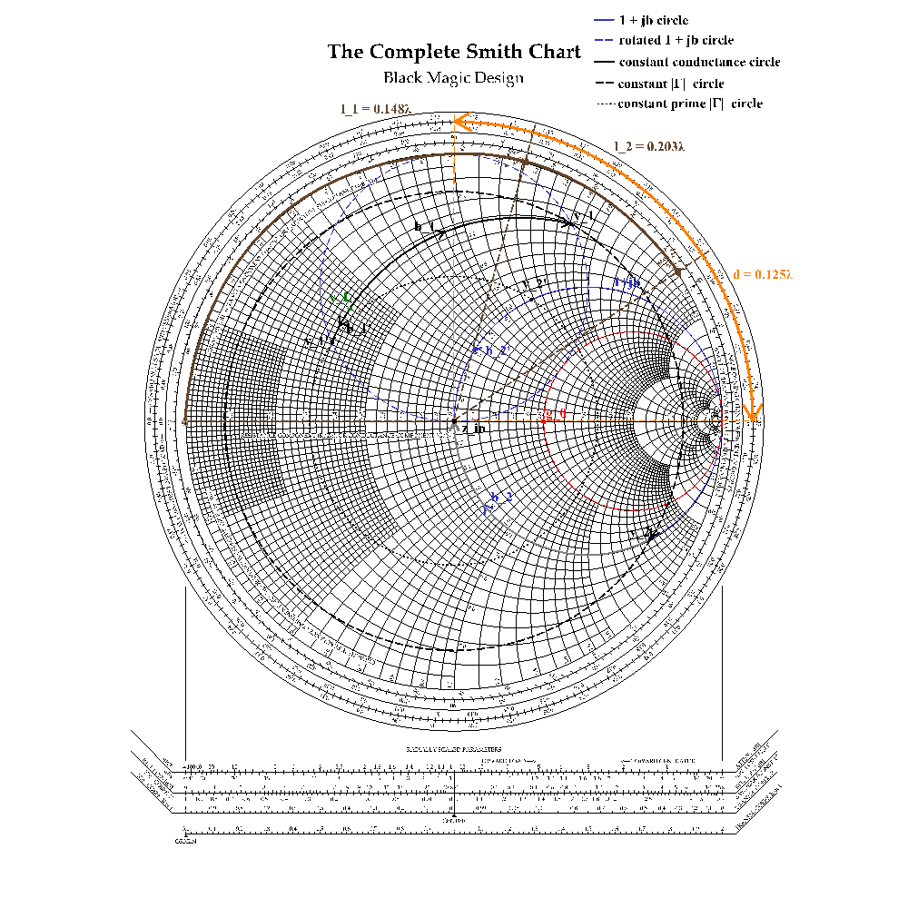
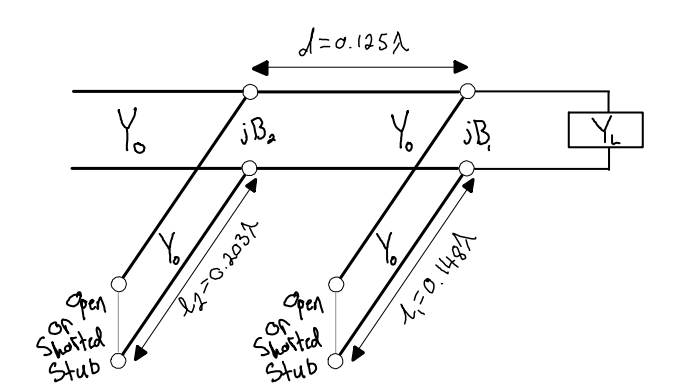
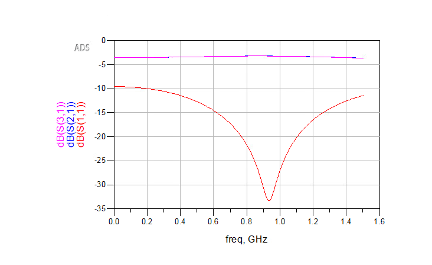
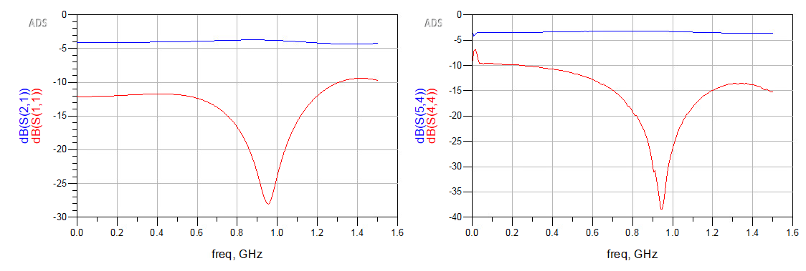
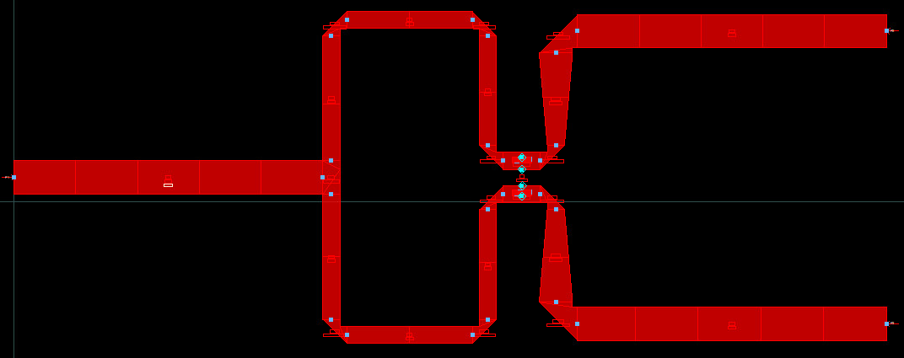
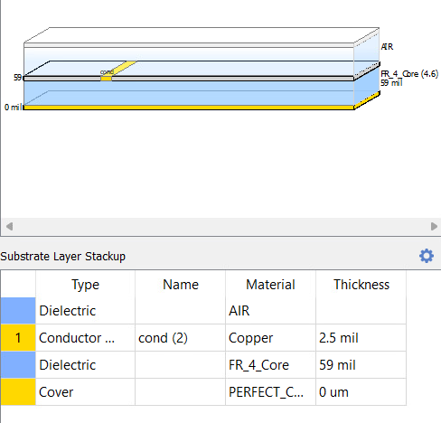

# Microwave Engineering: Transmission Lines, Matching, and Measurement

## Overview
This coursework focused on the analysis, design, simulation, fabrication, and measurement of microwave-frequency circuits where distributed effects dominate. Emphasis was placed on transmission-line theory, impedance matching, S-parameter analysis, and reconciling analytical and simulated predictions with measured hardware behavior.

The work integrates analytical design using Smith charts, full-wave electromagnetic simulation, physical layout considerations, and experimental validation using a vector network analyzer.

---

## Transmission Line Theory and Impedance Matching
Core microwave concepts were developed through analytical problem solving and design exercises, including transmission-line propagation, reflection coefficient, standing waves, and impedance transformation. Smith chart techniques were used extensively to design matching networks under practical constraints.

  

**Figure:** Smith chart–based design of a double shunt matching network. The chart illustrates rotation along the transmission line, identification of admittance intersections, and extraction of electrical lengths required for impedance matching.

The Smith chart solution was translated directly into a realizable transmission-line topology with specified stub lengths and spacing.

  

**Figure:** Physical realization of the double shunt stub matching network, showing characteristic admittance sections, open or short-circuited stubs, and spacing derived from the Smith chart design.

---

## Microwave Circuit Design and EM Simulation
Microwave circuits were designed using analytical transmission-line models and simulated using circuit-level tools. To capture distributed and parasitic effects, layouts were extracted and analyzed using full-wave electromagnetic simulation based on the Method of Moments (MoM).

This step highlighted the limitations of ideal transmission-line models and the importance of geometry, substrate properties, and discontinuities in microwave circuits.

---

## Wilkinson Power Divider: Design, Simulation, and Measurement
A Wilkinson power divider was designed, simulated, fabricated, and measured to evaluate power division, port matching, and isolation performance at microwave frequencies.

  

**Figure:** Full-wave MoM simulation of the Wilkinson power divider showing S-parameter performance and port matching behavior.

Following EM simulation, the design was optimized and fabricated. Measured results were compared against simulated predictions to identify sources of discrepancy.

  

**Figure:** Comparison of optimized simulated and measured S-parameters for the Wilkinson divider. Differences were analyzed in terms of fabrication tolerances, substrate loss, and connector effects.

  

**Figure:** Physical microstrip layout of the Wilkinson power divider used for fabrication and EM simulation.

  

**Figure:** Substrate stackup used for the MoM simulation, including conductor thickness and FR4 dielectric properties.

---

## Fabrication and Measurement
Fabricated microwave circuits were measured using a vector network analyzer with appropriate calibration. Measured S-parameters were interpreted using Smith charts and frequency-domain analysis, and results were compared against analytical and EM-simulated predictions.

Discrepancies between simulation and measurement were investigated and attributed to real-world effects such as dielectric loss, conductor roughness, connector launches, and fabrication tolerances.

---

## Key Skills Demonstrated
- Transmission-line and microwave circuit analysis  
- Smith chart–based impedance matching  
- S-parameter interpretation and network analysis  
- Full-wave EM simulation using the Method of Moments  
- Layout-aware microwave design  
- RF fabrication considerations  
- VNA measurement and calibration  
- Reconciling theory, simulation, and measured hardware  

---

## Summary
This work demonstrates end-to-end microwave engineering capability, spanning analytical design, EM simulation, physical layout, fabrication, and experimental validation. The emphasis on comparing analytical models, full-wave simulations, and measured results reflects practical RF engineering workflows and real-world constraints.

