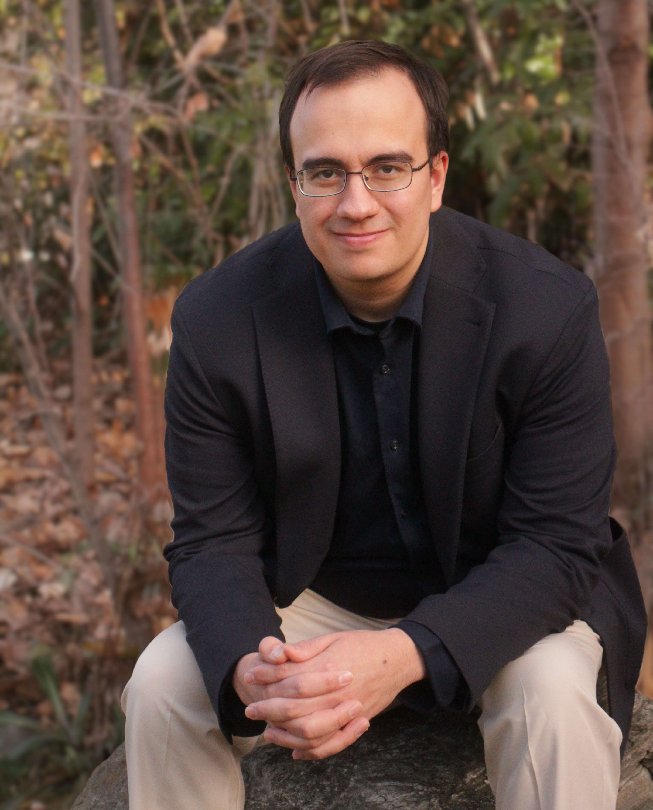

  

# Contact Information
Phone: (385)492-9704 | Email: giovanniagut@gmail.com | LinkedIn:[My Profile](https://www.linkedin.com/in/giovanni-gutierrez-6b58ba30b/)
 

---

# Purpose
I've written this e-portfolio to showcase my academic background, technical skills, and projects I've worked on in perperation for engineering roles. This living document thus acts as a reference point reflecting my current software, hardware, and conceptual level of expertise.

---

# Education

### Master of Science in Electrical Engineering - University of Utah

Graduated: December 2025 
Location: Salt Lake City, UT 
GPA: 3.73

**Activities/Achievements**

* Completed advanced graduate coursework in Digital Signal Processing, Antenna Theory and Design, and Microwave Engineering, applying MATLAB, ADS, and various EM simulation tools for modeling and analysis.

* Developed and implemented signal-processing pipelines in team-based engineering projects, including filter design, system verification, and frequency-domain analysis.

* Collaborated with engineering teams using structured project management practices, coordinating deadlines, requirements, and iterative design reviews.

* Recognized on the Chair’s List for academic excellence, reflecting high performance across rigorous technical coursework.

---

### Bachelor of Science in Physics Teaching - Weber State University

Graduated: December 2022 
Location: Ogden, UT 
Minors: Neuroscience, Mathematics 
GPA: 3.96

**Activities/Achievements**

* Performed hands-on thin-film deposition using a carbon evaporation system, troubleshooting inaccurate documentation, understanding tip-failure mechanisms, and establishing revised and reliable operating parameters for carbon deposition in an un-standardized non–inert-gas setup.

* Used Mathematica for electromagnetic modeling in upper-division electrostatics coursework, simulating field behavior and visualizing charge distributions.

* Applied SPICE in electronics coursework and independent exploration to simulate circuits, analyze component behavior, and validate expected device characteristics.

* Programmed microcontrollers in C to read sensor data and display real-time measurements on a digital screen, linking physical instrumentation with embedded systems.

[Transcript From Undergraduate Institution](BStranscript.pdf)

---

## Project Highlights

[Bandpass Filter Design and Application](DSP-project/) (DSP using MATLAB)

[Patch Antenna Design, Simulation, and Post-Fabrication Measurement](Antennas-project)

[Implementation of Various Electromagnetic Computational Techniques](EM-comp-project/) (MATLAB)

[DSP integration for RV32E MCU using tsmc18 (signed NDA) technology libraries](VLSI-project/) (ModelSim/Questa, Virtuoso/Calibre, Genus)

[Carbon Evaporation System from Undergraduate Research](Undergraduate-research)

---

## Relevant Coursework
*<u>Graduate</u>*

